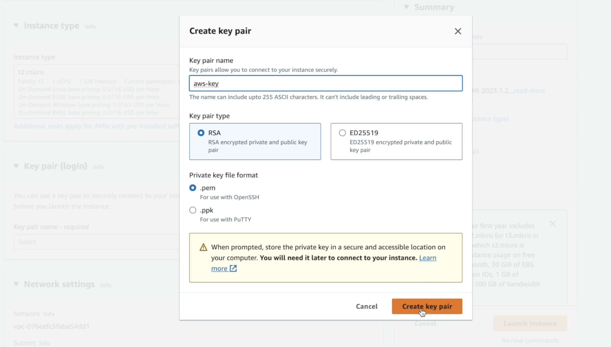
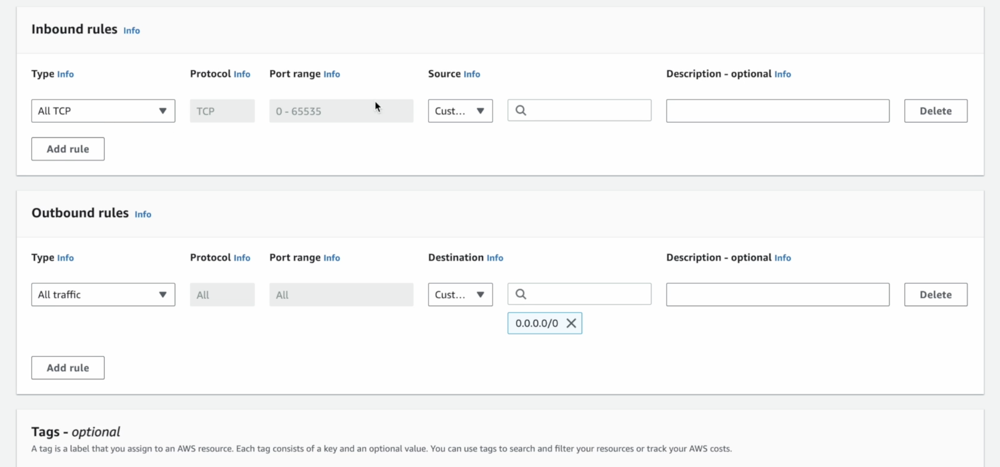
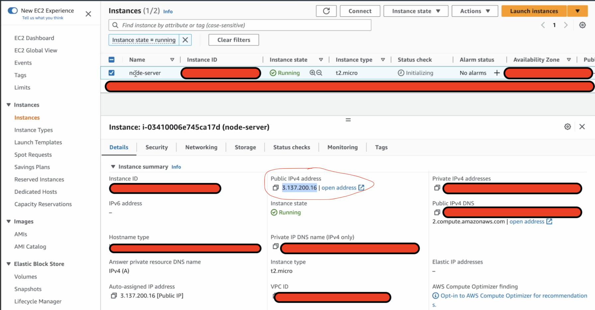
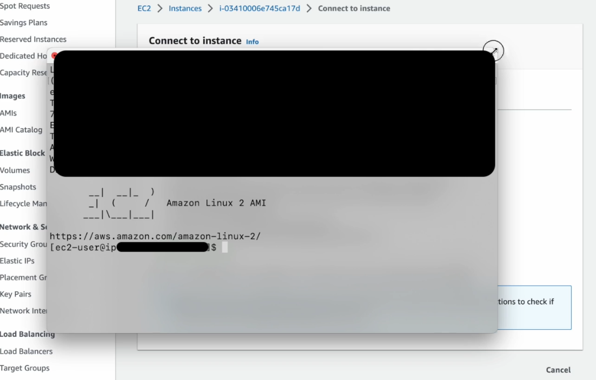

# Networking

[1) Understanding Networking Layers](https://github.com/fabio-miguel/tcp-nodejs-networking)

[2) Implementing TCP - **this repo**](https://github.com/fabio-miguel/chat-nodejs-app-networking)

## About - Chat App - Node.js

A simple TCP Chat application that uses the Command Line Interface to interact with users. The goal of this project was to practice using TCP in a practical and fun way for educational purposes. It was intended as a means to see how Node's `http` module builds on top of the `net` module and TCP. This is **NOT production ready** and if used as is, poses security issues for users. This uses a standard TCP connection, which means packets are unencrypted. Refer to the Issues / Improvements section below.

## Notes

### readline Module

`const readline = require("readline/promises");`

Using the readline module, you can interact with the console. You can move information from the console to the node process by using stdin.

```
const rl = readline.createInterface({
  input: process.stdin,
  output: process.stdout, // stdout was never used
});
```

- The readline module is used to interact with the command line interface (CLI).
- When you use readline.createInterface(), you are creating an instance of the Interface class, which allows you to interact with the CLI by providing methods like question().
- The process object is a global object provided by Node.js. It represents the current Node.js process that is running your application. The stdin property of the process object represents the standard input stream, which allows your Node.js application to receive input from the command line.
- When you use process.stdin, you're accessing the standard input stream, which is connected to the terminal or command prompt where your Node.js application is running. So, when you interact with the terminal by typing something and pressing Enter, you're sending input to the stdin stream.
- The readline module provides a way to listen for and handle input events on the stdin stream, allowing you to prompt the user for input and handle their responses asynchronously.

So, process.stdin represents the standard input stream of your Node.js application, which allows your application to receive input from the terminal. You can think of stdin as a means of inter-process communication between your Node.js application and the terminal environment.The readline module builds on top of this to provide a convenient way to interactively prompt users for input on the command line.

```
// client.js

const socket = net.createConnection(
  { host: "127.0.0.1", port: 3000 },
  async () => {
    console.log("connected to the server!");

    <b>const message = await rl.question("Enter a message > ");</b>

    <b>socket.write(message);</b>
  }
);
```

We are reading something from the console using the readline interface, and then we are saving whatever we receive from the console (process.stdin) to the message object. Then, we write / send that message over in our socket (a duplex stream), connected to the server, to the server. We can then send that data from the server back to the client.

```
// server.js

// in creating a server, we have access to the socket object
server.on("connection", (socket) => {
  console.log("A new connection to the server!");

  // a socket / duplex stream allowing us to make a connection to a client & read & write
  socket.on("data", (data) => {
    console.log(data.toString("utf-8"));

    // send message (data) back to the client socket (client chatroom)
    socket.write(data);
  });
});
```

### The problem with the method above

The problem with this is that every time we have a new client we have a new socket instance. So, if we have one hundred clients we will have 100 sockets and sending that data back from the server will send them to those independent sockets, thus each client will only ever get their own message back!

### Solution

The solution provided in the code of this repository was to keep track of all the client connections that you have in your application by creating an array. When we get a new client connection / socket, we simply write their data to all the other sockets, using the map method to iterate over the stored sockets in an array, so they receive it and then push the new socket into the array. Remember, socket is equivalent as saying "client connection."

### Reflective Issues / Improvements

The goal of this project was to complete the Minimum Viable Product (MVP) for a TCP application that is **NOT** production ready. It was for practice!

The most obvious problem is security! Anybody connected to the network could see the messages. The application is not encrypting the messages! It's simply using TCP to send data. TCP does not encrpyt! So, the messages can be viewed by using some fairly basic tech. Some info about Secure Shell (SSH) is below to help understand its importance and better understand the context for this application.

The client could be anything! Any sort of application could just send this server whatever and our server will display that mesasge. So we need a way to identify and authenticate users perhaps using some tokens or passwords. Again, a security issue.

User Interface (UI) issues were not addressed. For example, when entering a message, once entered, the message will log below and also remain in the prompt line for a new message. Ideally, you would integrate a funtion so that everytime a user puts a message in, you're going to clear the console, log the message that's come from the server and then ask the question again. There are methods such as `moveCursor()` and `clearLine()` that would help in "cleaning up" the UI.

Other identified issues / improvements include,the inability to identify users in the chat and notifying the chatroom when a user leaves or joins. I'm sure there are many possibilities for additional features and improvemnts. Again, the goal was to deliver an MVP for a TCP application and this is a nice foundation to build upon.

<details>
<summary>A Reference to Understanding the Network Layers</summary>

### Further Understanding the Application Layer

The upper most layer is the application layer. This application layer, in some models like the OSI model, can be further broken down into three separate layers. These would be \* _application_ _, _ _presentation_ \* and session.

Presentation simply means how you want to present the data. For instance, how to present headers and encrpytion. In other words, it is responsible for data translation and encryption. It ensures the data sent from the application layer of one machine can be read by the appliaction layer of another machine, regardless of different data representations. It handles tasks such as encryption, character encoding and compression.

The session layer manages the communcation between two hosts. It establishes and maintains interactions called seesions.

Essentialy, the application layer is what provides network services to end-users, presentation ensures data can be understood and session ensures reliable communication by managing the session.

</details>

<details>
<summary>Secure Shell (SSH)</summary>

### Secure Shell (SSH)

SSH first appeared in the mid 90's as a replacement way of connecting to a remote machine over the internet. Up until that time, the technologies available to connect to a remote machine like Telnet, RLogin, RSH etc worked fine, BUT they transmitted all the data in the clear over the network! So, if you logged into a remote machine, anyone with a packet sniffer between and the remote machine could see everything you weere doing there.


Now, when these protocols first appeared, that wasn's a problem because the machines were probably only networked within the computer department of a university or a company. So, the people who had access to do that probably worked there and wouldn't do that.

As machines got networked to other networks and the internet waas being built, if you had access to the network, well any network that the data was travelling over you could sniff the packets.


So, Tatu Ylönen, a Finnish professor, was concerned about this and developed the protocol SSH to encrypt the data so that you couldn't see what was being sent over. You could see the data that was being transmitted across, you could see how much data, the frequency of it, BUT you couldn't see what the data was! So, **SSH was developed as a way of encrpyting the connection between two machines.** However, it does a lot more than that.

The first thing that happens when you open up a TCP connection between two machines (note: it doesn't have to be a TCP connection), you've got a reliable connection between two machines, SSH is sending data over, and what SSH does is that it breaks the data down into a series of packets.

**Packet**


Of course, as with any packet transfer, these packets have a few headers at the beginning. Perhaps at the top you would have something that tells you how big the packet is (packet length), how much padding there is and then the data you want, called the payload. Then, you have the padding that follows that. So, what you are doing with each packet after the payload is adding padding. These are just random bytes that don't mean anything, but they force the encrption to make it harder to detect what's going on because you've got this random data in there. Lastly, you would have some sort of message authentication code. You can then apply compression, if you want, to the payload. So, you can compress the payload by using standard compression algorithms, such as zlib, to compress the data. Then, the whole of that packet (excluding the length) is then encrypted. The algorithms used for the encryption and for the message authentication code are selected by the server and the client. They are established at the beginning... which ones they offer and which they want to use. So, these vary from connection to connection. So the packet length is left unencrypted as we need to know how much data is coming.

**SSH Packet**


At the other end, the server will decrpyt and then it knows its got the packet of data and can then piece it back together. So, on the server-side you do the opposite, decrpyt the packet, decompress the payload, and you can extract the data and sort of "stitch it back" together.

So, you have the unecrypted TCP connection. On top of that you have these packets that are encypted by the SSH protocol. On top of that, you then open a series of channels that you send the data over. This isn't to be confused with creating a new channel. This is actually creating a connection through these SSH packets.

</details>

<details>
<summary>Deploying Chat App to AWS</summary>

### Key Pair Login

Refers to the SSH key pair that is used for secure access to your EC2 instance. It consists of a public key and a private key. When you launch the EC2 instance, you specify the key pair to use for accessing that instance. The public key is placed on the instance itself during launch and the private key is kept securely on your local machine. So, when you connect to your EC2 instance using SSH, you specify the private key and if it matches the public key associated with it, you are granted access to the EC2 instance.



### Creating a Security Group

In AWS EC2, a security group acts as a virtual firewall that controls the traffic to and from your EC2 instances. You’ve got two different rules. One is outbound and one is inbound.

Inbound means the traffic that comes into your EC2 instance / server. The rules control this incoming traffic. For example, the type of traffic allowed to reach your instance and the source of that traffic. Each inbound rule consists of:

**Type:** specifying the protocol such as HTTP (port 80), SSH (port 22), or HTTPS (port 443).
**Port Range:** Specifies the port or range of ports for the traffic. For example, port 22 for SSH or ports 80-443 for HTTP and HTTPS.
**Source:** Specifies the source of the incoming traffic. This can be specified as an IP address, a CIDR block (e.g., a range of IP addresses), another security group, or 0.0.0.0/0 to allow traffic from any IP address (not recommended for production environments).

Outbound rules basically mean what traffic can go outside the server. For example, you can allow everything. So, your server could connect to the outside internet without any limitations. Each outbound rule is similar to an inbound rule but controls outgoing traffic instead:

**Type:** Specifies the protocol or type of outgoing traffic.
**Port Range:** Specifies the port or range of ports for the outgoing traffic.
**Destination:** Specifies the destination of the outgoing traffic. This can be specified as an IP address, a CIDR block, another security group, or 0.0.0.0/0 to allow traffic to any destination.

Now, for this chat app, we allow all traffic outbound and all TCP traffic inbound.



Once you launch your EC2 instance / node-server, you will notice your Public IPv4 address.



This is the address that you can use to connect to this very server / EC2 instance! Now, remember that IP addresses are unique addresses for each computer. So, we identify computers on the internet via their IP address.

Next to the public IP, you can see the private IP. But, if you want to connect to the EC2 instance, you will need to use the public IP not the private IP. The private IP is that of the previous example when you connected your phone or iPad to your node application on your MacBook. However, it is the public IP address that you will use to connect to it and for the client application to connect to this server. YOU NEED AN IP ADDRESS FOR A SERVER! Otherwise it’s not a server.

To connect to your instance / server you could use the IP address or perhaps assign a domain name, which is the alias for your server. This is because the IP address could change. In fact, you could technically assign an Elastic IP address to it, which would assign a static IPv4 address. This allows you to associate a persistent IP address with an instance. So, the instance retains the same public IP address even if it is stopped and restarted. The alternative to an Elastic IP is, as mentioned at the start of this paragraph, is to use a Domain Name System (DNS). The DNS will allow you to associate a domain name with an IP address. This also and still ensures consistent access.

<details>
<summary>Connecting to an EC2 Instance Using SSH with Private Key Authentication</summary>

### Connecting to an EC2 Instance Using SSH with Private Key Authentication

**ssh**
This is the command to initiate an SSH connection to a remote server.

**-i**
This option specifies the identity file (private key) to use for authentication.

**~/.ssh/<filename>.pem**
This is the path to the private key file (cododev.pem) stored in the .ssh directory in the user's home directory (~). The private key is used to authenticate the SSH connection to the remote server.

After specifying the private key with -i, you would typically include the username and the domain name (or IP address) of the server you want to connect to.

```
ssh -i ~/.ssh/<filename>.pem <username>@<domain_or_IP>

ssh -i ~/.ssh/example.pem EC2-user@example.com
```

There’s a possibility this may not work initially and you receive a “WARNING: UNPROTECTED PRIVATE KEY FILE!” message and that you must allow permission for you, the owner (your AWS account), to read the file. This can be done using the following command:



Now, when you access your instance you will notice that if you were to run `ls` on the current directory, there would be nothing. Also, `node -v` would show that you don’t have Node.js installed on the instance. So, you will have to set up and configure the EC2 instance environment to suit your application’s requirements (e.g. software packages etc.), deploy the application, security configurations and so on. This is where you recognise the power of Docker!

<details>
<summary>A sidenote on Docker</summary>

### A sidenote on Docker:

_Docker streamlines the whole process of deploying and managing applications, especially in cloud environments like AWS EC2 instances._

- _Consistent Environment: Docker allows you to package your application and its dependencies into a container, which encapsulates everything the application needs to run. This ensures that the application runs consistently across different environments, including development, testing, and production._

- _Isolation: Docker containers provide process isolation, meaning each container runs as an isolated environment with its own filesystem, network, and resources. This isolation ensures that applications running in containers do not interfere with each other and helps improve security._

- _Portability: Docker containers are portable and can run on any platform that supports Docker. This makes it easy to deploy applications across different environments, including on-premises servers, cloud instances, and even developer laptops._

- _Scalability: Docker containers are lightweight and fast to start, making them well-suited for scalable applications. You can easily scale your application by running multiple instances of the same container across multiple hosts._

- _Infrastructure as Code: Docker containers can be managed and orchestrated using tools like Docker Compose, Docker Swarm, or Kubernetes. These tools allow you to define your application's infrastructure as code, making it easy to automate deployment, scaling, and management tasks._

_Overall, Docker simplifies the process of deploying and managing applications by providing a consistent, isolated, and portable runtime environment. This can be particularly beneficial when deploying applications to cloud environments like AWS EC2 instances, where consistency, scalability, and automation are important considerations._

</details>

You will need to run your server on the public IP address. We can use this IP address in our application’s `.listen()` method so that the application is listening for connections to the EC2 instance where this application is running.

<details>
<summary>A sidenote on Environment Variables:</summary>

### A sidenote on Environment Variables:

_Now, you could just copy and paste this in, but this isn’t the best way to do this for security reasons. Not even in development should you use this practice. This is because this is a potential security issue and any sensitive data should not be made public._

_Usually in production and development, you would use:_

```
process.env.VARIABLE_NAME

process.env.IP_ADDRESS

process.env.PORT
```

_This will store these variables will be stored unassigned. In production, you will manually set the values for these variables. AWS securely stores these values and makes them available to your application._

_In development, you will set the values of these variables manually using commands like:_

```
export IP_ADDRESS=value
```

_This will store the value in your current shell session which is separate to your application environment and will be lost once the shell is closed. This way even in development you do not risk accidentally pushing sensitive data to public environments like GitHub. An alternative in development is to use something like a `dotenv` file (or another alternative) where this is not ever pushed with your code to a public sphere._

</details>

Once you have your server set up, you can create your application file.

`touch chat-server.js`

Open the file in a lightweight text editor available in Unix-like operating systems, such as Linux and macOS using the `nano` command.

`nano chat-server.js`

So, up until this point you will have launched a Linux computer, installed Node.js (probably using NVM) and any other dependencies, created a file and pasted your server code into it. You can now run your server on this EC2 instance and connect to it.

Now, this isn’t the typical method for deploying your application on a server, but rather a simplified example of how to get a server working. As mentioned, Docker is very powerful and is pretty much the industry standard and common practice because it containerises your application and environment so you don’t have to configure your EC2 instance to mimic development environment. For example, without Docker and the simple / minimalist method we just used, we would have to probably prepare the app by compressing it into a `.zip` file, then upload to EC2, then extract, then install all the dependencies required by your Node.js application, then start your application.

Again, this is a simplistic and manual approach to deploying a Node.js application to an EC2 instance by copying and pasting code directly into a file on the instance. In a real-world production environment, there are additional steps to ensure performance, scalability and reliability. For example:

- High Availability: Setting up multiple instances of your application in different availability zones or regions to ensure fault tolerance.
- Load Balancing to distribute incoming traffic across multiple instances, improving performance and reliability

**This topic follows onto understanding IPv4 addresses which can be found in this repo:**

[3) Implementing DNS](https://github.com/fabio-miguel/dns-nodejs-networking)

</details>
