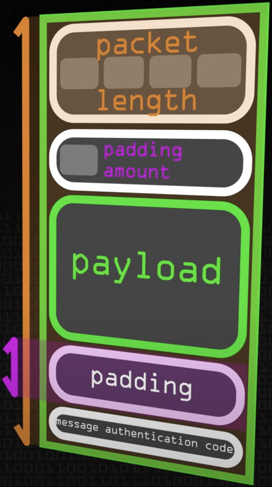

# Networking

[1) Understanding Networking Layers](https://github.com/fabio-miguel/tcp-nodejs-networking)

## About - Chat App - Node.js

A simple TCP Chat application that uses the Command Line Interface to interact with users. The goal of this project was to practice using TCP in a practical and fun way for educational purposes. It was intended as a means to see how Node's `http` module builds on top of the `net` module and TCP. This is **NOT production ready** and if used as is, poses security issues for users. This uses a standard TCP connection, which means packets are unencrypted. Refer to the Issues / Improvements section below.

## Notes

### readline Module

`const readline = require("readline/promises");`

Using the readline module, you can interact with the console. You can move information from the console to the node process by using stdin.

```
const rl = readline.createInterface({
  input: process.stdin,
  output: process.stdout, // stdout was never used
});
```

- The readline module is used to interact with the command line interface (CLI).
- When you use readline.createInterface(), you are creating an instance of the Interface class, which allows you to interact with the CLI by providing methods like question().
- The process object is a global object provided by Node.js. It represents the current Node.js process that is running your application. The stdin property of the process object represents the standard input stream, which allows your Node.js application to receive input from the command line.
- When you use process.stdin, you're accessing the standard input stream, which is connected to the terminal or command prompt where your Node.js application is running. So, when you interact with the terminal by typing something and pressing Enter, you're sending input to the stdin stream.
- The readline module provides a way to listen for and handle input events on the stdin stream, allowing you to prompt the user for input and handle their responses asynchronously.

So, process.stdin represents the standard input stream of your Node.js application, which allows your application to receive input from the terminal. You can think of stdin as a means of inter-process communication between your Node.js application and the terminal environment.The readline module builds on top of this to provide a convenient way to interactively prompt users for input on the command line.

```
// client.js

const socket = net.createConnection(
  { host: "127.0.0.1", port: 3000 },
  async () => {
    console.log("connected to the server!");

    <b>const message = await rl.question("Enter a message > ");</b>

    <b>socket.write(message);</b>
  }
);
```

We are reading something from the console using the readline interface, and then we are saving whatever we receive from the console (process.stdin) to the message object. Then, we write / send that message over in our socket (a duplex stream), connected to the server, to the server. We can then send that data from the server back to the client.

```
// server.js

// in creating a server, we have access to the socket object
server.on("connection", (socket) => {
  console.log("A new connection to the server!");

  // a socket / duplex stream allowing us to make a connection to a client & read & write
  socket.on("data", (data) => {
    console.log(data.toString("utf-8"));

    // send message (data) back to the client socket (client chatroom)
    socket.write(data);
  });
});
```

### The problem with the method above

The problem with this is that every time we have a new client we have a new socket instance. So, if we have one hundred clients we will have 100 sockets and sending that data back from the server will send them to those independent sockets, thus each client will only ever get their own message back!

### Solution

The solution provided in the code of this repository was to keep track of all the client connections that you have in your application by creating an array. When we get a new client connection / socket, we simply write their data to all the other sockets, using the map method to iterate the over the stored sockets in an array, so they receive it and then push the new socket into the array. Remember, socket is equivalent as saying "client connection."

### Reflective Issues / Improvements

The goal of this project was to complete the Minimum Viable Product (MVP) for a TCP application that is **NOT** production ready. It was for practice!

The most obvious problem is security! Anybody connected to the network could see the messages. The application is not encrypting the messages! It's simply using TCP to send data. TCP does not encrpyt! So, the messages can be viewed by using some fairly basic tech. Some info about Secure Shell (SSH) is below to help understand its importance and better understand the context for this application.

The client could be anything! Any sort of application could just send this server whatever and our server will display that mesasge. So we need a way to identify and authenticate users perhaps using some tokens or passwords. Again, a security issue.

User Interface (UI) issues were not addressed. For example, when entering a message, once entered, the message will log below and also remain in the prompt line for a new message. Ideally, you would integrate a funtion so that everytime a user puts a message in, you're going to clear the console, log the message that's come from the server and then ask the question again. There are methods such as `moveCursor()` and `clearLine()` that would help in "cleaning up" the UI.

Other identified issues / improvements include,the inability to identify users in the chat and notifying the chatroom when a user leaves or joins. I'm sure there are many possibilities for additional features and improvemnts. Again, the goal was to deliver an MVP for a TCP application and this is a nice foundation to build upon.

<details>
<summary>A Reference to Understanding the Netowrk Layers</summary>

### Further Understanding the Application Layer

The upper most layer is the application layer. This application layer, in some models like the OSI model, can be further broken down into three separate layers. These would be \* _application_ _, _ _presentation_ \* and session.

Presentation simply means how you want to present the data. For instance, how to present headers and encrpytion. In other words, it is responsible for data translation and encryption. It ensures the data sent from the application layer of one machine can be read by the appliaction layer of another machine, regardless of different data representations. It handles tasks such as encryption, character encoding and compression.

The session layer manages the communcation between two hosts. It establishes and maintains interactions called seesions.

Essentialy, the application layer is what provides network services to end-users, presentation ensures data can be understood and session ensures reliable communication by managing the session.

</details>

<details>
<summary>Secure Shell (SSH)</summary>

### Secure Shell (SSH)

SSH first appeared in the mid 90's as a replacement way of connecting to a remote machine over the internet. Up until that time, the technologies available to connect to a remote machine like Telnet, RLogin, RSH etc worked fine, BUT they transmitted all the data in the clear over the network! So, if you logged into a remote machine, anyone with a packet sniffer between and the remote machine could see everything you weere doing there.


Now, when these protocols first appeared, that wasn's a problem because the machines were probably only networked within the computer department of a university or a company. So, the people who had access to do that probably worked there and wouldn't do that.

As machines got networked to other networks and the internet waas being built, if you had access to the network, well any network that the data was travelling over you could sniff the packets.


So, Tatu Ylönen, a Finnish professor, was concerned about this and developed the protocol SSH to encrypt the data so that you couldn't see what was being sent over. You could see the data that was being transmitted across, you could see how much data, the frequency of it, BUT you couldn't see what the data was! So, **SSH was developed as a way of encrpyting the connection between two machines.** However, it does a lot more than that.

The first thing that happens when you open up a TCP connection between two machines (note: it doesn't have to be a TCP connection), you've got a reliable connection between two machines, SSH is sending data over, and what SSH does is that it breaks the data down into a series of packets.

**Packet**



Of course, as with any packet transfer, these packets have a few headers at the beginning. Perhaps at the top you would have something that tells you how big the packet is (packet length), how much padding there is and then the data you want, called the payload. Then, you have the padding that follows that. So, what you are doing with each packet after the payload is adding padding. These are just random bytes that don't mean anything, but they force the encrption to make it harder to detect what's going on because you've got this random data in there. Lastly, you would have some sort of message authentication code. You can then apply compression, if you want, to the payload. So, you can compress the payload by using standard compression algorithms, such as zlib, to compress the data. Then, the whole of that packet (excluding the length) is then encrypted. The algorithms used for the encryption and for the message authentication code are selected by the server and the client. They are established at the beginning... which ones they offer and which they want to use. So, these vary from connection to connection. So the packet length is left unencrypted as we need to know how much data is coming.

**SSH Packet**


At the other end, the server will decrpyt and then it knows its got the packet of data and can then piece it back together. So, on the server-side you do the opposite, decrpyt the packet, decompress the payload, and you can extract the data and sort of "stitch it back" together.

So, you have the unecrypted TCP connection. On top of that you have these packets that are encypted by the SSH protocol. On top of that, you then open a series of channels that you send the data over. This isn't to be confused with creating a new channel. This is actually creating a connection through these SSH packets.

</details>
